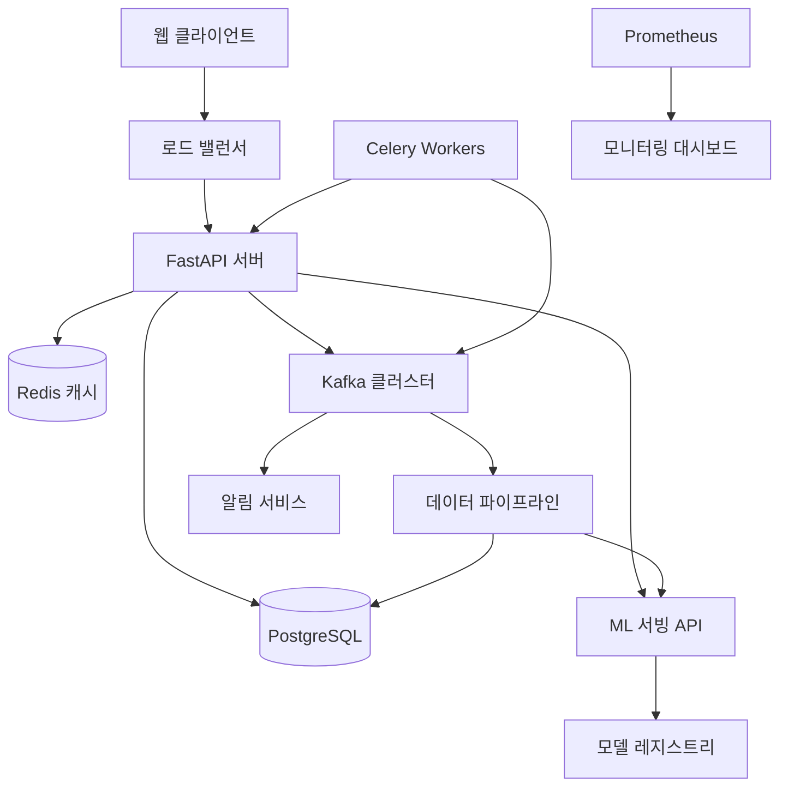

# 🚀 Market Insights Pro - 고급 개발 로드맵 & 체크리스트

시급한 오류 사항
리포트 페이지에 데이터 정렬 기능을 추가하는
  것이었습니다.

  구체적으로는, 사용자가 '판매량', '평점', '가격' 등 다양한 기준으로 제품 목록을
  재정렬할 수 있도록 '정렬 기준' 드롭다운 메뉴를 UI에 추가하고, 이 선택에 따라
  테이블의 데이터가 실시간으로 바뀌는 JavaScript 로직을 report.html 파일에
  구현하려고 했습니다.

  하지만, 파일 수정 과정에서 반복적으로 오류가 발생하여 완료하지 못했습니다.
오류 메시지: Failed to edit, 0 occurrences found for old_string

  이 오류는 replace 도구를 사용하여 파일을 수정하려고 할 때 발생합니다.

  오류 원인

  오류의 근본 원인은 제가 파일을 수정하기 위해 replace 도구를 사용할 때,
  교체의 기준이 되는 기존 파일 내용(`old_string`)을 잘못 전달했기
  때문입니다.

  조금 더 상세히 설명하면 다음과 같은 과정이 반복되었습니다.

   1. A라는 내용의 report.html 파일을 수정하기 위해 replace를 시도합니다.
   2. 성공적으로 수정되어 파일 내용은 B가 됩니다.
   3. 그 다음 단계에서 B의 내용을 추가로 수정하여 C로 만들려고 할 때, 저는 B가
      아닌, 제 기억 속의 이전 내용인 A를 기준으로 replace를 시도했습니다.
   4. 실제 파일의 내용은 B인데, 저는 A를 찾으려고 하니 당연히 찾을 수 없었고,
      "기존 내용(old_string)을 찾을 수 없어 수정을 실패했다"는 오류가 발생한
      것입니다.

  결과적으로 '파일 읽기 -> 잘못된 내용으로 수정 시도 -> 실패 -> 사과 -> 다시
  파일 읽기'의 비효율적인 루프에 빠졌습니다.

## 📋 프로젝트 개요

**목표**: 현재 Amazon Market Insights Pro MVP를 실무급 대용량 시스템으로 발전시키기  
**학습 기간**: 8주 (160시간)  
**학습 방법**: 단계별 체크리스트 완료, 실습 중심 학습  

## 🎯 핵심 학습 목표

### 1. 현대적 대시보드 UI 구축
- **기술**: Tailwind CSS, Chart.js, WebSocket, 반응형 디자인
- **목표**: 인터랙티브하고 실시간 업데이트되는 프로페셔널한 대시보드

### 2. Redis 분산 캐싱 시스템
- **기술**: Redis, 캐싱 전략, 성능 최적화
- **목표**: 응답 속도 10배 향상, 메모리 효율적 캐시 관리

### 3. 대용량 트래픽 처리
- **기술**: 비동기 처리, 큐 시스템, 로드밸런싱
- **목표**: 동시 사용자 500명+ 처리 가능한 시스템

### 4. Apache Kafka 이벤트 스트리밍
- **기술**: Kafka, 이벤트 기반 아키텍처, 실시간 데이터 처리
- **목표**: 확장 가능한 마이크로서비스 아키텍처 구축

### 5. 머신러닝 파이프라인
- **기술**: Scikit-learn, 예측 모델링, 추천 시스템
- **목표**: AI 기반 시장 분석 및 예측 기능

## 📅 8주 상세 로드맵

---

## 🗓 Week 1-2: UI 현대화 & 기본 인프라 구축

### 🎯 주차 목표
- 현재 Bootstrap 기반 UI를 Tailwind CSS로 전환
- Chart.js 통합하여 인터랙티브 차트 구현
- Redis 기본 연동 및 세션 캐싱

### 📋 Week 1 체크리스트

#### Day 1-2: 개발 환경 준비
- [x] **Tailwind CSS 설치 및 설정**
  - [x] npm 프로젝트 초기화 (`npm init -y`)
  - [x] Tailwind CSS 설치 (`npm install -D tailwindcss@^3.4.0`)
  - [x] `tailwind.config.js` 설정 파일 생성 (커스텀 컬러, 애니메이션 포함)
  - [x] CSS 빌드 프로세스 구축 (`input.css` → `output.css`)
  - [x] PostCSS 설정 및 빌드 스크립트 추가
  - [x] 기존 Bootstrap 클래스를 Tailwind로 마이그레이션 완료 (base.html, index.html, report.html)

- [x] **Chart.js 설치 및 기본 차트 구현**
  - [x] Chart.js CDN 설치 (base.html에 통합)
  - [x] 경쟁 분석 결과를 도넛 차트로 시각화 (Prime vs Standard 제품)
  - [x] 가격 대 평점 관계를 라인 차트로 표시
  - [x] TOP 10 제품을 인터랙티브 테이블 + 바 차트 조합으로 표시
  - [x] 현대적인 Tailwind CSS 기반 대시보드 UI 구현

#### Day 3-4: Redis 기본 연동
- [x] **Redis 설치 및 설정**
  - [x] Docker를 통한 Redis 컨테이너 실행 (Redis 7.4.5)
  - [x] Python redis 라이브러리 설치 및 requirements.txt 추가
  - [x] FastAPI와 Redis 연결 설정 (CacheManager 클래스 구현)
  - [x] 연결 테스트 및 기본 get/set 작업 확인 (응답시간 1.25ms)

- [x] **기본 캐싱 구현**
  - [x] 분석 결과 캐싱 구현 (키: `market_insights:analysis:{hash}:{keyword}`, TTL: 1시간)
  - [x] 스크래핑 진행 상태 캐싱 (세션 기반 실시간 업데이트)
  - [x] 캐시 히트/미스 로그 및 통계 API 엔드포인트 추가
  - [x] 캐시 관리 API 구현 (/api/cache/health, /api/cache/stats, /debug/cache-test)
  - [x] FastAPI 시작/종료 이벤트에 Redis 헬스체크 통합

#### Day 5-7: UI 컴포넌트 개발
- [x] **메인 대시보드 개선**
  - [x] 카드 기반 레이아웃으로 전환 (shadow-card 및 hover 효과 적용)
  - [x] 로딩 스피너 및 진행률 표시 개선 (애니메이션 강화)
  - [x] 반응형 그리드 시스템 적용 (모바일 대응)
  - [x] 다크모드 토글 기능 추가 (시스템 설정 자동 감지, localStorage 저장)

- [x] **고급 UI 컴포넌트 구현**
  - [x] MarketInsightsDashboard 클래스 기반 JavaScript 아키텍처
  - [x] 알림 시스템 (성공, 에러, 경고, 정보 타입별 스타일링)
  - [x] 버튼 리플 효과 및 호버 애니메이션
  - [x] 스크롤 애니메이션 (Intersection Observer 활용)
  - [x] 키보드 단축키 지원 (Ctrl/Cmd + D로 다크모드 전환)
  - [x] 실시간 차트 업데이트 (WebSocket 준비)

### 📋 Week 2 체크리스트

#### Day 1-3: WebSocket 실시간 업데이트
- [x] **WebSocket 서버 구현**
  - [x] FastAPI WebSocket 엔드포인트 추가
  - [x] 스크래핑 진행 상황 실시간 브로드캐스트
  - [x] 클라이언트 연결 관리 (연결/해제 처리)

- [x] **프론트엔드 WebSocket 클라이언트**
  - [x] JavaScript WebSocket 클라이언트 구현
  - [x] 진행률 바 실시간 업데이트
  - [x] 분석 완료 시 자동 페이지 리프레시
  - [x] 연결 오류 처리 및 재연결 로직

#### Day 4-5: 고급 UI 컴포넌트
- [-] **대시보드 위젯화 (사용자 요청으로 건너뜀)**
  - [-] 드래그 앤 드롭으로 위젯 재배열 (Sortable.js)
  - [-] 위젯 최소화/최대화 기능
  - [-] 사용자 레이아웃 설정 로컬스토리지 저장

- [x] **데이터 필터링 UI**
  - [x] 가격 범위 슬라이더 구현
  - [ ] 카테고리별 필터 체크박스
  - [x] 정렬 옵션 (가격, 평점, 리뷰 수)
  - [x] 검색 결과 실시간 필터링

#### Day 6-7: 성능 최적화 및 테스트
- [ ] **프론트엔드 최적화**
  - [x] CSS/JS 번들 최적화
  - [-] 이미지 lazy loading
  - [x] 차트 렌더링 성능 개선
  - [x] 모바일 터치 제스처 최적화

- [ ] **테스트 및 브라우저 호환성**
  - [-] Chrome, Firefox, Safari 테스트
  - [x] 모바일 브라우저 테스트 (iOS, Android)
  - [-] 다양한 화면 해상도에서 테스트
  - [-] 접근성 (Accessibility) 개선

### 🎯 Week 1-2 학습 포인트
- **CSS 프레임워크 전환**: Bootstrap → Tailwind 마이그레이션 경험
- **실시간 통신**: WebSocket을 활용한 실시간 데이터 업데이트
- **캐싱 기초**: Redis 기본 사용법과 캐싱 전략
- **현대적 UI**: 인터랙티브한 차트와 반응형 디자인

---

## 🗓 Week 3-4: 고급 캐싱 & Kafka 이벤트 스트리밍

### 🎯 주차 목표
- Redis 고급 캐싱 전략 구현 (분산 캐싱, 캐시 무효화)
- Apache Kafka 클러스터 구축 및 이벤트 기반 아키텍처 도입
- 실시간 데이터 파이프라인 구축

### 📋 Week 3 체크리스트

#### Day 1-2: Redis 고급 캐싱 전략
- [x] **캐시 계층화 (Multi-level Caching)**
  - [x] L1 캐시: 메모리 내 캐시 (lru_cache 데코레이터)
  - [x] L2 캐시: Redis 캐시 (분석 결과, 스크래핑 데이터)
  - [-] L3 캐시: 데이터베이스 쿼리 최적화
  - [-] 캐시 우선순위 및 제거 정책 구현

- [x] **캐시 무효화 전략**
  - [x] Time-based 무효화 (TTL 설정)
  - [x] Event-based 무효화 (데이터 변경시)
  - [x] 수동 무효화 (관리자 도구)
  - [x] 캐시 워밍 (서버 시작시 중요 데이터 미리 로드)

#### Day 3-4: Apache Kafka 설치 및 기본 설정
- [x] **Kafka 클러스터 구축**
  - [x] Docker Compose로 Kafka + Zookeeper 설정 (프로덕션 레벨 헬스체크 포함)
  - [x] 기본 토픽 생성 (`market-analysis-events`, `scraping-status-updates`, `user-notifications`)
  - [x] Kafka UI 도구 설치 (provectuslabs/kafka-ui:latest)
  - [x] Python kafka 클라이언트 설치 (`pip install kafka-python`)
  - [x] Producer/Consumer 기본 테스트 완료

- [x] **이벤트 스키마 설계**
  ```python
  # 실제 구현된 이벤트 타입별 스키마 정의
  ANALYSIS_COMPLETED = {
      "event": "analysis_completed",
      "keyword": "wireless mouse", 
      "timestamp": "2025-09-12T00:10:00Z",
      "results": {
          "competitor_count": 15,
          "avg_price": 29.99
      }
  }
  
  # 토픽별 설정
  # market-analysis-events: 3 파티션, 7일 보존
  # scraping-status-updates: 2 파티션, 1일 보존  
  # user-notifications: 1 파티션, 3일 보존
  ```

#### Day 5-7: 이벤트 기반 아키텍처 구현
- [ ] **Producer 구현**
  - [ ] 스크래핑 시작/완료 이벤트 발송
  - [ ] 분석 결과 이벤트 발송
  - [ ] 사용자 액션 이벤트 발송 (페이지 방문, 키워드 검색)
  - [ ] 배치 이벤트 발송 최적화

- [ ] **Consumer 구현**
  - [ ] 실시간 알림 시스템 (이메일, 슬랙)
  - [ ] 데이터 집계 Consumer (통계 생성)
  - [ ] 로그 수집 Consumer (ELK 스택 준비)
  - [ ] 오류 처리 및 재시도 로직

### 📋 Week 4 체크리스트

#### Day 1-3: 실시간 데이터 파이프라인
- [ ] **스트리밍 데이터 처리**
  - [ ] Kafka Streams 또는 Python 기반 스트리밍 처리
  - [ ] 실시간 시장 동향 분석 파이프라인
  - [ ] 이상치 탐지 스트리밍 처리
  - [ ] 윈도우 기반 집계 (sliding window, tumbling window)

- [ ] **이벤트 소싱 패턴 구현**
  - [ ] 모든 사용자 액션을 이벤트로 저장
  - [ ] 이벤트 재생을 통한 상태 복구
  - [ ] CQRS (Command Query Responsibility Segregation) 적용
  - [ ] 이벤트 버전 관리 및 스키마 진화

#### Day 4-5: 분산 시스템 패턴
- [ ] **Saga 패턴 구현**
  - [ ] 스크래핑 → 분석 → 캐싱의 분산 트랜잭션
  - [ ] 보상 트랜잭션 (Compensating Transaction)
  - [ ] 프로세스 매니저 구현
  - [ ] 실패 처리 및 복구 전략

- [ ] **Circuit Breaker 패턴**
  - [ ] Amazon 스크래핑 실패시 자동 차단
  - [ ] 헬스 체크 및 자동 복구
  - [ ] Fallback 메커니즘 (캐시된 데이터 사용)
  - [ ] 모니터링 및 알람

#### Day 6-7: 성능 최적화 및 모니터링
- [ ] **Kafka 성능 튜닝**
  - [ ] 파티션 전략 최적화
  - [ ] 배치 크기 및 압축 설정
  - [ ] Consumer 그룹 밸런싱
  - [ ] 메모리 및 디스크 사용량 모니터링

- [ ] **캐시 성능 분석**
  - [ ] Redis 메모리 사용량 프로파일링
  - [ ] 캐시 히트율 모니터링 대시보드
  - [ ] 슬로우 쿼리 탐지 및 최적화
  - [ ] 캐시 성능 A/B 테스트

### 🎯 Week 3-4 학습 포인트
- **이벤트 기반 아키텍처**: Kafka를 활용한 마이크로서비스 간 통신
- **분산 캐싱**: Redis 클러스터와 고급 캐싱 패턴
- **실시간 처리**: 스트리밍 데이터 파이프라인 구축
- **분산 시스템 패턴**: Saga, Circuit Breaker, Event Sourcing

---

## 🗓 Week 5-6: 대용량 트래픽 처리 시스템

### 🎯 주차 목표
- 비동기 작업 큐 시스템 구축 (Celery + Redis)
- 부하 테스트 및 성능 최적화
- 모니터링 및 알람 시스템 구축
- 오토 스케일링 구현

### 📋 Week 5 체크리스트

#### Day 1-2: Celery 분산 작업 큐
- [ ] **Celery 설치 및 설정**
  - [ ] Celery 및 관련 패키지 설치
  - [ ] Redis를 메시지 브로커로 설정
  - [ ] 워커 프로세스 설정 및 실행
  - [ ] Flower 모니터링 도구 설치

- [ ] **비동기 작업 분리**
  - [ ] 스크래핑 작업을 백그라운드로 이동
  - [ ] 분석 작업 비동기 처리
  - [ ] 이메일 발송 비동기 처리
  - [ ] 파일 생성/처리 작업 분리

#### Day 3-4: 작업 큐 고도화
- [ ] **작업 우선순위 및 라우팅**
  - [ ] 우선순위 큐 구현 (high/normal/low)
  - [ ] 작업 타입별 전용 워커 배치
  - [ ] 라우팅 키를 통한 작업 분산
  - [ ] 실패한 작업 재시도 정책

- [ ] **작업 상태 추적**
  - [ ] 실시간 작업 진행률 추적
  - [ ] 작업 결과 저장 및 조회
  - [ ] 실패 작업 로그 및 알림
  - [ ] 작업 시간 통계 수집

#### Day 5-7: API 성능 최적화
- [ ] **데이터베이스 최적화**
  - [ ] 인덱스 최적화 (EXPLAIN ANALYZE 활용)
  - [ ] 쿼리 최적화 및 N+1 문제 해결
  - [ ] 커넥션 풀 크기 조정
  - [ ] 읽기 전용 복제본 활용

- [ ] **API 응답 최적화**
  - [ ] 페이징 구현 (무한 스크롤)
  - [ ] 응답 압축 (gzip)
  - [ ] 조건부 요청 (ETag, Last-Modified)
  - [ ] API 버전 관리 체계

### 📋 Week 6 체크리스트

#### Day 1-2: 부하 테스트
- [ ] **Locust 부하 테스트 스크립트**
  ```python
  # 테스트 시나리오 작성
  - 동시 사용자 수: 100/500/1000명
  - 평균 사용 패턴: 검색 → 분석 → 결과 조회
  - 스파이크 테스트: 갑작스런 트래픽 증가
  - 지속성 테스트: 24시간 연속 부하
  ```

- [ ] **성능 메트릭 수집**
  - [ ] 응답 시간 분포 (P50, P95, P99)
  - [ ] 처리량 (RPS - Requests Per Second)
  - [ ] 에러율 및 타임아웃 비율
  - [ ] 리소스 사용률 (CPU, 메모리, 디스크)

#### Day 3-4: 모니터링 시스템 구축
- [ ] **Prometheus + Grafana 설치**
  - [ ] Prometheus 서버 설정
  - [ ] FastAPI 메트릭 수집기 구현
  - [ ] Grafana 대시보드 구성
  - [ ] 알람 규칙 설정 (AlertManager)

- [ ] **커스텀 메트릭 구현**
  - [ ] 비즈니스 메트릭 (분석 요청 수, 성공률)
  - [ ] 기술 메트릭 (응답 시간, 에러율)
  - [ ] 인프라 메트릭 (서버 리소스)
  - [ ] 사용자 메트릭 (활성 사용자 수)

#### Day 5-7: 오토 스케일링 및 고가용성
- [ ] **Docker 컨테이너화**
  - [ ] 멀티 스테이지 Dockerfile 작성
  - [ ] Docker Compose 서비스 구성
  - [ ] 컨테이너 헬스 체크 구현
  - [ ] 환경별 설정 관리 (.env 파일)

- [ ] **로드 밸런싱**
  - [ ] Nginx 리버스 프록시 설정
  - [ ] upstream 서버 구성
  - [ ] 헬스 체크 기반 라우팅
  - [ ] 세션 스티키니스 (필요시)

### 🎯 Week 5-6 학습 포인트
- **비동기 처리**: Celery를 활용한 백그라운드 작업 처리
- **성능 테스트**: Locust를 이용한 체계적인 부하 테스트
- **모니터링**: Prometheus + Grafana 모니터링 스택
- **확장성**: 컨테이너화와 오토 스케일링

---

## 🗓 Week 7-8: 머신러닝 파이프라인 & 시스템 통합

### 🎯 주차 목표
- 머신러닝 모델 개발 및 배포
- MLOps 파이프라인 구축
- 전체 시스템 통합 및 최적화
- 프로덕션 배포 준비

### 📋 Week 7 체크리스트

#### Day 1-2: 데이터 분석 및 피처 엔지니어링
- [ ] **데이터 탐색 및 전처리**
  - [ ] 수집된 Amazon 데이터 EDA (Exploratory Data Analysis)
  - [ ] 결측치 처리 및 이상치 탐지
  - [ ] 데이터 품질 평가 및 정제
  - [ ] 시계열 데이터 패턴 분석

- [ ] **피처 엔지니어링**
  - [ ] 가격 관련 피처 생성 (가격 범위, 상대 가격)
  - [ ] 경쟁력 지표 생성 (평점 대비 가격, 리뷰 수 비율)
  - [ ] 시간 기반 피처 (계절성, 요일별 패턴)
  - [ ] 텍스트 피처 (제품명 키워드 TF-IDF)

#### Day 3-4: 예측 모델 개발
- [ ] **가격 예측 모델**
  - [ ] 회귀 모델 학습 (Linear, Random Forest, XGBoost)
  - [ ] 모델 평가 (RMSE, MAE, R²)
  - [ ] 하이퍼파라미터 튜닝 (Grid Search)
  - [ ] 특성 중요도 분석

- [ ] **수요 예측 모델**
  - [ ] 시계열 예측 모델 (ARIMA, Prophet)
  - [ ] 계절성 및 트렌드 분석
  - [ ] 예측 구간 추정 (Confidence Interval)
  - [ ] 모델 성능 백테스팅

#### Day 5-7: 추천 시스템 구축
- [ ] **카테고리 추천 엔진**
  - [ ] 협업 필터링 구현 (User-based, Item-based)
  - [ ] 콘텐츠 기반 필터링
  - [ ] 하이브리드 추천 시스템
  - [ ] 추천 성능 평가 (Precision, Recall, F1)

- [ ] **개인화 알고리즘**
  - [ ] 사용자 프로필 생성 (implicit feedback)
  - [ ] 실시간 추천 업데이트
  - [ ] A/B 테스트 프레임워크
  - [ ] 추천 다양성 및 신규성 보장

### 📋 Week 8 체크리스트

#### Day 1-2: MLOps 파이프라인
- [ ] **모델 버전 관리**
  - [ ] MLflow 설치 및 설정
  - [ ] 실험 추적 및 모델 등록
  - [ ] 모델 아티팩트 저장 및 관리
  - [ ] 모델 성능 비교 대시보드

- [ ] **자동화된 모델 파이프라인**
  - [ ] 데이터 수집 → 전처리 → 학습 → 평가 파이프라인
  - [ ] 모델 재학습 트리거 (데이터 드리프트 탐지)
  - [ ] CI/CD 통합 (모델 배포 자동화)
  - [ ] 모델 롤백 메커니즘

#### Day 3-4: ML 서빙 시스템
- [ ] **실시간 예측 API**
  - [ ] 모델 서빙 서버 구축 (FastAPI + joblib/pickle)
  - [ ] 배치 예측 시스템 (대용량 처리)
  - [ ] 모델 캐싱 및 성능 최적화
  - [ ] 예측 결과 검증 및 로깅

- [ ] **ML 모니터링**
  - [ ] 모델 성능 드리프트 탐지
  - [ ] 입력 데이터 분포 모니터링
  - [ ] 예측 정확도 추적
  - [ ] 모델 재학습 트리거 조건

#### Day 5-7: 시스템 통합 및 최적화
- [ ] **전체 아키텍처 통합**
  - [ ] 모든 컴포넌트 연동 테스트
  - [ ] 데이터 플로우 최적화
  - [ ] 서비스 간 의존성 관리
  - [ ] 장애 복구 시나리오 테스트

- [ ] **최종 성능 최적화**
  - [ ] End-to-end 응답 시간 최적화 (<2초 목표)
  - [ ] 메모리 사용량 최적화
  - [ ] 캐시 전략 재검토 및 개선
  - [ ] 데이터베이스 쿼리 최종 최적화

### 🎯 Week 7-8 학습 포인트
- **머신러닝**: 실무급 예측 모델링 및 추천 시스템
- **MLOps**: 모델 생명주기 관리 및 자동화
- **시스템 통합**: 복잡한 분산 시스템 아키텍처
- **성능 최적화**: 대용량 시스템 튜닝 노하우

---

## 🏗 최종 시스템 아키텍처



## 📊 성능 목표 & KPI

### 최종 달성 목표
- **동시 사용자**: 500명 이상
- **API 응답 시간**: P95 < 500ms
- **분석 완료 시간**: 평균 60초 이내
- **시스템 가용성**: 99.5% 이상
- **캐시 히트율**: 85% 이상
- **ML 모델 정확도**: MAE < 10% (가격 예측)

### 학습 성과 측정
- **기술 스택 숙련도**: 각 기술별 실무 수준 달성
- **아키텍처 설계 역량**: 확장 가능한 시스템 설계
- **성능 최적화 경험**: 병목 지점 파악 및 해결
- **모니터링 문화**: 데이터 기반 의사결정

## 🔧 트러블슈팅 가이드

### 자주 발생하는 문제들
1. **Redis 메모리 부족**
   - 해결: 메모리 사용량 모니터링, TTL 최적화
2. **Kafka 컨슈머 랙**
   - 해결: 파티션 증가, 컨슈머 그룹 스케일링
3. **데이터베이스 슬로우 쿼리**
   - 해결: 인덱스 최적화, 쿼리 리팩터링
4. **ML 모델 성능 저하**
   - 해결: 데이터 드리프트 탐지, 재학습 자동화

## 📚 추천 학습 자료

### 필수 문서
- [FastAPI 공식 문서](https://fastapi.tiangolo.com/)
- [Redis 가이드](https://redis.io/documentation)
- [Apache Kafka 문서](https://kafka.apache.org/documentation/)
- [Celery 사용자 가이드](https://docs.celeryproject.org/)

### 심화 학습
- [분산 시스템 패턴](https://microservices.io/patterns/)
- [머신러닝 시스템 설계](https://www.oreilly.com/library/view/designing-machine-learning/9781098107956/)
- [고성능 웹 애플리케이션](https://web.dev/performance/)

---

**프로젝트 시작일**: 2025년 9월 9일  
**예상 완료일**: 2025년 11월 4일 (8주)  
**문서 버전**: v1.0  
**최종 업데이트**: 2025년 9월 9일

---

## ✅ 진행 현황 추적

- [ ] Week 1-2 완료 (UI 현대화 & Redis 기본)
- [ ] Week 3-4 완료 (고급 캐싱 & Kafka)  
- [ ] Week 5-6 완료 (대용량 트래픽 처리)
- [ ] Week 7-8 완료 (ML 파이프라인 & 통합)

**현재 진행**: Week 1 시작 준비 중...