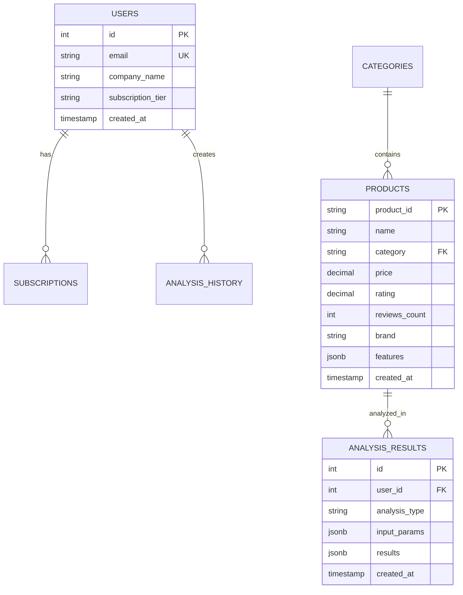

# 🚀 마켓 인사이트 - B2B 시장 분석 도구 개발 계획서

## 📋 프로젝트 개요

### 프로젝트명
**Market Insights Pro** - AI 기반 이커머스 시장 분석 플랫폼

### 프로젝트 목표
Amazon 제품 데이터를 활용하여 소상공인과 온라인 판매자들에게 실시간 시장 인사이트를 제공하는 B2B SaaS 서비스 개발

### 타겟 사용자
- 온라인 쇼핑몰 운영자 (네이버 스마트스토어, 쿠팡 파트너스)
- 제품 기획자 및 마케터
- 신규 창업 준비자

### 핵심 가치 제안
"데이터 기반 의사결정으로 성공 확률을 높이는 스마트 비즈니스 도구"

---

## 🛠 기술 스택

### Backend
- **Framework**: FastAPI (Python 3.9+)
- **Database**: PostgreSQL 14 + Redis 7
- **ML/Analytics**: Pandas, NumPy, Scikit-learn, NLTK
- **Background Tasks**: Celery + Redis
- **API Documentation**: Swagger/OpenAPI

### Frontend
- **Dashboard**: Streamlit (MVP용)
- **Charts**: Plotly, Chart.js
- **Future**: React.js + TypeScript

### Infrastructure
- **Containerization**: Docker + Docker Compose
- **Deployment**: AWS EC2 + RDS + ElastiCache
- **Monitoring**: Prometheus + Grafana
- **CI/CD**: GitHub Actions

### Data Processing
- **ETL**: Apache Airflow (추후)
- **File Processing**: Pandas, openpyxl
- **NLP**: spaCy, transformers (키워드 분석)

---

## 📅 개발 일정 (8주 계획)

## Week 5: 데이터 분석 및 핵심 알고리즘 개발

### Day 1-2: 프로젝트 설정 및 데이터 탐색
```bash
# 환경 설정
- Python 가상환경 생성
- requirements.txt 작성
- Docker 개발환경 구축
- 캐글 데이터셋 다운로드 및 EDA
```

**주요 작업:**
- Amazon 데이터셋 구조 분석
- 데이터 품질 검증 (결측치, 이상치)
- 카테고리별 제품 분포 시각화
- 가격-평점-리뷰수 상관관계 분석

### Day 3-4: 핵심 분석 모듈 개발
```python
# core/analyzer.py
class MarketAnalyzer:
    def analyze_category_competition(self, category, price_range)
    def find_price_gaps(self, category)
    def extract_success_keywords(self, high_rated_products)
    def calculate_market_saturation(self, category)
```

**구현 기능:**
- 카테고리별 경쟁 분석 엔진
- 가격 공백 구간 탐지 알고리즘
- 키워드 추출 및 트렌드 분석 (TF-IDF)
- 제품 포지셔닝 매트릭스 생성

### Day 5-7: 데이터베이스 설계 및 구축
```sql
-- 핵심 테이블 설계
CREATE TABLE products (
    product_id VARCHAR PRIMARY KEY,
    name TEXT,
    category VARCHAR(100),
    price DECIMAL(10,2),
    rating DECIMAL(3,2),
    reviews_count INT,
    brand VARCHAR(100),
    created_at TIMESTAMP
);

CREATE TABLE market_analysis (
    id SERIAL PRIMARY KEY,
    category VARCHAR(100),
    analysis_type VARCHAR(50),
    data JSONB,
    created_at TIMESTAMP
);

CREATE TABLE users (
    id SERIAL PRIMARY KEY,
    email VARCHAR UNIQUE,
    company_name VARCHAR(100),
    subscription_tier VARCHAR(20),
    created_at TIMESTAMP
);
```

## Week 6: API 서버 개발 및 비즈니스 로직 구현

### Day 1-3: FastAPI 서버 기본 구조
```python
# API 엔드포인트 설계
@app.post("/api/analyze/category")
async def analyze_category(request: CategoryAnalysisRequest):
    """카테고리 경쟁 분석"""
    
@app.post("/api/analyze/pricing")  
async def analyze_pricing(request: PricingAnalysisRequest):
    """가격 포지셔닝 분석"""
    
@app.post("/api/keywords/extract")
async def extract_keywords(request: KeywordRequest):
    """성공 키워드 추출"""
    
@app.get("/api/reports/market/{category}")
async def get_market_report(category: str):
    """시장 리포트 생성"""
```

### Day 4-5: 핵심 비즈니스 로직 구현
- 경쟁사 자동 탐지 시스템
- 최적 가격 추천 알고리즘
- 시장 포화도 계산 엔진
- 제품명 최적화 제안 시스템

### Day 6-7: 데이터 처리 최적화
- Redis 캐싱 전략 구현
- 비동기 분석 작업 (Celery)
- 대용량 데이터 처리 최적화
- API 응답 속도 개선 (<500ms 목표)

## Week 7: 사용자 인터페이스 개발

### Day 1-3: Streamlit 대시보드 개발
```python
# streamlit_app.py 주요 페이지
1. 🏠 홈: 전체 시장 현황 대시보드
2. 🔍 카테고리 분석: 상세 경쟁 분석
3. 💰 가격 전략: 최적 가격 포지셔닝
4. 📊 키워드 분석: SEO 최적화 제안
5. 📈 트렌드: 시장 동향 및 예측
6. ⚙️ 설정: 사용자 프로필 관리
```

### Day 4-5: 인터랙티브 차트 구현
- Plotly 기반 시각화 컴포넌트
- 실시간 필터링 기능
- 데이터 드릴다운 기능
- 리포트 PDF 출력 기능

### Day 6-7: UX 개선 및 반응형 설계
- 모바일 대응 레이아웃
- 로딩 상태 표시
- 에러 핸들링 및 사용자 가이드
- A/B 테스트를 위한 기능 플래그

## Week 8: 성능 최적화 및 배포

### Day 1-2: 성능 테스트 및 최적화
```python
# locustfile.py - 부하 테스트 시나리오
class BusinessUser(HttpUser):
    wait_time = between(2, 5)
    
    @task(3)
    def analyze_category(self):
        # 카테고리 분석 API 테스트
        
    @task(2)
    def get_market_report(self):
        # 시장 리포트 조회 테스트
        
    @task(1)
    def extract_keywords(self):
        # 키워드 분석 테스트
```

**성능 목표:**
- 동시 사용자 100명 처리
- API 응답 시간 P95 < 1초
- 대시보드 로딩 시간 < 3초

### Day 3-4: AWS 배포 환경 구축
```yaml
# docker-compose.yml
version: '3.8'
services:
  web:
    build: .
    ports:
      - "8000:8000"
  db:
    image: postgres:14
    environment:
      POSTGRES_DB: market_insights
  redis:
    image: redis:7-alpine
  worker:
    build: .
    command: celery -A main.celery worker --loglevel=info
```

### Day 5-6: 모니터링 및 로깅 시스템
- Prometheus 메트릭 수집
- Grafana 대시보드 구성
- 에러 추적 시스템 (Sentry)
- 사용자 행동 분석 (Google Analytics)

### Day 7: 문서화 및 런칭 준비
- API 문서 완성 (Swagger)
- 사용자 가이드 작성
- GitHub README 정리
- 데모 환경 배포

---

## 🎯 핵심 기능 명세

### 1. 카테고리 경쟁 분석
**입력:** 카테고리, 가격 범위
**출력:** 
- 경쟁사 수 및 분포
- 평균 평점 vs 가격 매트릭스
- 시장 점유율 상위 10개 제품
- 진입 난이도 점수 (1-10)

### 2. 가격 포지셔닝 전략
**입력:** 제품 정보, 타겟 마진율
**출력:**
- 최적 가격 범위 제안
- 가격 대비 예상 경쟁력
- 유사 제품 벤치마킹
- 할인 전략 시뮬레이션

### 3. 키워드 분석 및 최적화
**입력:** 제품 카테고리, 타겟 키워드
**출력:**
- 고성과 키워드 TOP 20
- 키워드 경쟁 강도 분석
- 제품명 최적화 제안
- SEO 친화적 설명문 템플릿

### 4. 시장 기회 발굴
**입력:** 관심 카테고리, 예산 범위
**출력:**
- 가격 공백 구간 탐지
- 신흥 트렌드 키워드
- 블루오션 서브 카테고리
- 시장 진입 타이밍 분석

---

## 💾 데이터베이스 설계

### ERD 구조


### 인덱스 전략
```sql
-- 성능 최적화를 위한 인덱스
CREATE INDEX idx_products_category ON products(category);
CREATE INDEX idx_products_price ON products(price);
CREATE INDEX idx_products_rating ON products(rating);
CREATE INDEX idx_products_category_price ON products(category, price);
CREATE INDEX idx_analysis_user_type ON analysis_results(user_id, analysis_type);
```

---

## 🔌 API 설계

### Authentication
```python
# JWT 기반 인증
POST /api/auth/login
POST /api/auth/register
POST /api/auth/refresh
GET  /api/auth/me
```

### Core Analytics APIs
```python
# 시장 분석
POST /api/analyze/category
POST /api/analyze/pricing
POST /api/analyze/competition
POST /api/analyze/keywords

# 리포트 생성
GET  /api/reports/market/{category}
GET  /api/reports/pricing/{product_id}
POST /api/reports/custom

# 데이터 조회
GET  /api/products/search
GET  /api/categories/list
GET  /api/trends/keywords
```

### Rate Limiting
```python
# 구독 티어별 제한
FREE_TIER: 10 requests/hour
BASIC_TIER: 100 requests/hour  
PRO_TIER: 1000 requests/hour
ENTERPRISE: Unlimited
```

---

## 🎨 UI/UX 설계

### 대시보드 레이아웃
```
┌─────────────────────────────────────────────┐
│ 🏠 Market Insights Pro                     │
├─────────────────────────────────────────────┤
│ 📊 Overview | 🔍 Analysis | 📈 Reports     │
├─────────────────────────────────────────────┤
│                                             │
│  [시장 현황 KPI Cards]                      │
│                                             │
│  ┌─────────────┐  ┌─────────────┐          │
│  │ 카테고리     │  │ 가격 분석   │          │
│  │ 경쟁 분석    │  │ 차트        │          │
│  └─────────────┘  └─────────────┘          │
│                                             │
│  ┌─────────────────────────────────────┐   │
│  │ 인사이트 및 추천사항                │   │
│  └─────────────────────────────────────┘   │
└─────────────────────────────────────────────┘
```

### 색상 및 브랜딩
- **Primary**: #2E86AB (Professional Blue)
- **Secondary**: #A23B72 (Insight Purple) 
- **Success**: #F18F01 (Action Orange)
- **Background**: #F6F6F6 (Clean Gray)

---

## 🚀 배포 및 운영

### 배포 아키텍처
```
┌─────────────┐    ┌─────────────┐    ┌─────────────┐
│   Client    │───→│ Application │───→│  Database   │
│ (Streamlit) │    │ Load Balancer│    │(PostgreSQL) │
└─────────────┘    └─────────────┘    └─────────────┘
                           │
                   ┌─────────────┐
                   │   Redis     │
                   │  (Cache)    │
                   └─────────────┘
```

### AWS 리소스 구성
```yaml
Production Environment:
  - EC2 t3.medium (Application Server)
  - RDS db.t3.micro (PostgreSQL)
  - ElastiCache t3.micro (Redis)
  - S3 (Static Files, Reports)
  - CloudFront (CDN)
  - Route 53 (DNS)

Development Environment:
  - EC2 t3.small
  - RDS db.t3.micro
  - ElastiCache t3.micro
```

### CI/CD 파이프라인
```yaml
# .github/workflows/deploy.yml
name: Deploy to AWS
on:
  push:
    branches: [main]
    
jobs:
  deploy:
    runs-on: ubuntu-latest
    steps:
      - uses: actions/checkout@v2
      - name: Build Docker Image
      - name: Push to ECR
      - name: Deploy to EC2
      - name: Run Health Check
```

---

## 💰 비즈니스 모델 및 수익화

### 구독 티어 설계
```python
FREE_TIER = {
    "price": 0,
    "monthly_analyses": 5,
    "categories_access": 3,
    "report_exports": 0,
    "support": "Community"
}

BASIC_TIER = {
    "price": 49_000,  # 월 49,000원
    "monthly_analyses": 50,
    "categories_access": "All",
    "report_exports": 10,
    "support": "Email"
}

PRO_TIER = {
    "price": 149_000,  # 월 149,000원  
    "monthly_analyses": "Unlimited",
    "categories_access": "All",
    "report_exports": "Unlimited",
    "support": "Priority Email + Chat",
    "api_access": True
}

ENTERPRISE_TIER = {
    "price": "Custom",
    "features": "All + Custom Features",
    "support": "Dedicated Account Manager",
    "sla": "99.9% Uptime Guarantee"
}
```

### 수익 예측 (6개월)
```
Month 1-2: MVP 런칭, 베타 사용자 20명
Month 3-4: 마케팅 시작, 유료 사용자 50명 
Month 5-6: 입소문 확산, 유료 사용자 200명

예상 MRR (Month 6):
- Basic (150명): 150 × 49,000 = 7,350,000원
- Pro (40명): 40 × 149,000 = 5,960,000원  
- Enterprise (10명): 10 × 300,000 = 3,000,000원
총 MRR: 16,310,000원
```

---

## 🎯 마케팅 전략

### 타겟 고객 획득 채널
1. **콘텐츠 마케팅**
   - 네이버 블로그: "온라인 쇼핑몰 성공 가이드"  
   - YouTube: "데이터로 보는 쇼핑몰 트렌드"
   
2. **커뮤니티 마케팅**
   - 네이버 카페: 온라인쇼핑몰사장모임
   - 페이스북 그룹: 스마트스토어 운영자 모임
   
3. **파트너십**
   - 쇼핑몰 솔루션 업체와 제휴
   - 온라인 마케팅 교육업체와 협업

### 초기 론칭 전략
```python
Phase 1: 베타 테스터 모집 (무료)
- 타겟: 온라인 판매 경험 1년+ 사업자
- 혜택: 6개월 Pro 플랜 무료 제공
- 피드백 수집 및 제품 개선

Phase 2: 프리미엄 기능 출시  
- Early Bird 할인 (50% Off)
- 성공 사례 스토리 제작
- 추천 프로그램 도입

Phase 3: 스케일업
- SEO 최적화 진행
- 광고 마케팅 시작  
- 기업 고객 대상 영업
```

---

## ⚠️ 위험 요소 및 대응 방안

### 기술적 위험
**위험:** 대용량 데이터 처리 성능 이슈
**대응:** Redis 캐싱, 비동기 처리, DB 쿼리 최적화

**위험:** AWS 비용 급증
**대응:** CloudWatch 알람 설정, 오토스케일링 정책 수립

### 비즈니스 위험
**위험:** 시장 진입 시기 지연
**대응:** MVP 빠른 출시, 사용자 피드백 기반 개선

**위험:** 경쟁사 등장 (대기업 진입)
**대응:** 니치 마켓 특화, 고객 밀착 서비스

### 법적 위험  
**위험:** 데이터 저작권 문제
**대응:** 공개 데이터만 활용, 개인정보 처리 최소화

**위험:** 사업자등록 및 세무 문제
**대응:** 법인 설립, 세무사 자문

---

## 📈 성공 지표 (KPIs)

### 제품 지표
```python
# 사용자 참여도
- DAU/MAU Ratio > 30%
- Session Duration > 10분
- 분석 완료율 > 80%
- 리포트 다운로드율 > 60%

# 비즈니스 지표  
- Monthly Recurring Revenue (MRR)
- Customer Acquisition Cost (CAC) < 100,000원
- Customer Lifetime Value (LTV) > 1,000,000원
- Churn Rate < 5%/month

# 기술 지표
- API Response Time < 1초
- System Uptime > 99.5%  
- Error Rate < 1%
```

### 마일스톤 설정
```
Week 8: MVP 런칭 (기능 완성도 80%)
Month 3: 베타 사용자 50명 확보
Month 6: MRR 1,000만원 달성  
Month 12: 유료 사용자 500명 달성
```

---

## 🔧 추후 확장 계획

### 기능 확장 로드맵
```python
# Quarter 2: 고급 분석 기능
- AI 기반 수요 예측
- 경쟁사 가격 변동 알림  
- 소셜 미디어 트렌드 분석

# Quarter 3: 플랫폼 확장
- 11번가, G마켓 데이터 추가
- 모바일 앱 개발
- 팀 협업 기능

# Quarter 4: 고객 성공 도구
- 자동화된 리포트 발송
- 맞춤형 컨설팅 서비스
- API 생태계 구축
```

### 기술 혁신 계획
- **Machine Learning**: 개인화 추천 시스템
- **Real-time Analytics**: 실시간 시장 모니터링  
- **AI Assistant**: 챗봇 기반 인사이트 제공
- **Blockchain**: 데이터 무결성 보장

---

## 📚 참고 자료

### 기술 문서
- [FastAPI Documentation](https://fastapi.tiangolo.com/)
- [Streamlit Documentation](https://docs.streamlit.io/)
- [PostgreSQL Performance Tuning](https://wiki.postgresql.org/wiki/Performance_Optimization)

### 비즈니스 참고
- [SaaS Metrics 2.0](http://www.forentrepreneurs.com/saas-metrics-2/)
- [Product-Market Fit Guide](https://pmf.firstround.com/)
- [B2B Customer Success](https://www.gainsight.com/customer-success/)

---

**프로젝트 시작일**: Week 5 시작
**예상 완성일**: Week 8 종료  
**총 개발 기간**: 4주 (160시간)
**팀 구성**: 1인 풀스택 개발

**연락처**: [GitHub Repository Link]
**문서 버전**: v1.0
**최종 업데이트**: 2025년 9월